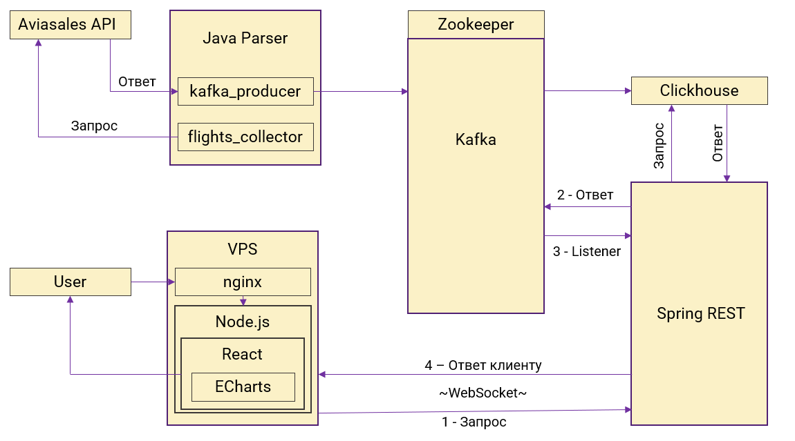
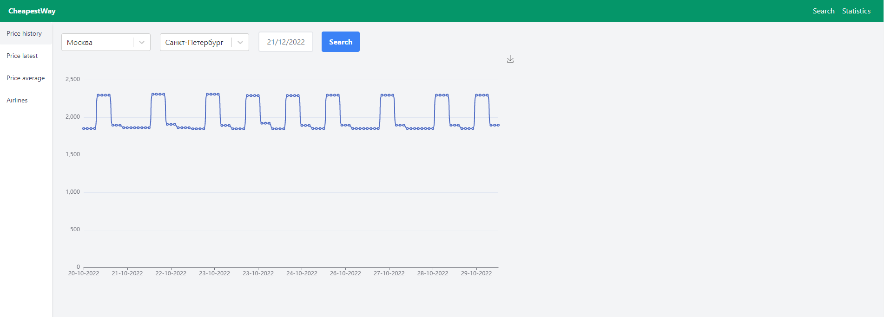
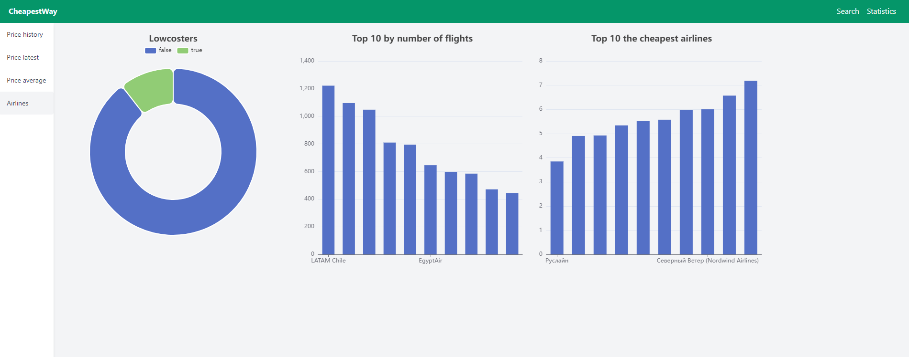

# Сервис для сбора статистики по авиабилетам CheapestWay.ru

## :page_with_curl:    Содержание

➠ [Аналитические задачи](#pushpin-аналитические-задачи)

➠ [Технологический стек](#computer-технологический-стек)

➠ [Архитектура проекта](#globe_with_meridians-архитектура-проекта)

➠ [Запуск приложения](#technologist-запуск-приложения)

➠ [Примеры страниц приложения](#история-цен-на-авиабилеты)

## :pushpin: Аналитические задачи

- [x] Зависимость стоимости авиабилета от дня покупки
- [x] Зависимость стоимости авиабилета от количества дней до вылета
- [x] Анализ стоимости авиабилета от дня недели покупки
- [x] Сравнение стоимости авиабилетов различных авиакомпаний

## :computer: Технологический стек

<p align="center">


</p>

В данном проекте серверная часть состоит из модуля сбора данных, написанного на <code>Java</code> и работающего с <code>Aviasales API</code>,
и <code>Spring-REST</code> сервиса. Клиентская часть реализована с помощью <code>React</code> - <code>TypeScript</code>.

> В качестве базы данных используется <code>ClickHouse</code>.
> 
> Для связи между сервисами используется брокер сообщений - <code>Apache Kafka</code>, который работает поверх <code>ZooKeeper</code>, распределенного сервиса конфигурирования и синхронизации.
>
> <code>Spring REST</code> принимает обращения к серверу и ставит их в очередь сообщений в <code>Kafka</code>.
> После чего запрос обрабатывается и отправляет ответ клиенту по протоколу<code>WebSocket</code>.
>
> С клиентской стороны веб-сервер работает на <code>Nginx</code>, который ссылается на <code>Node.js</code>.
> Веб-приложение написано с помощью библиотеки <code>React</code>. За визуализацию данных отвечает <code>Apache ECharts</code>.
> 
> Серверная и клиентская части запускаются в <code>Docker</code>.

## :globe_with_meridians: Архитектура проекта

<p align="center">
  
</p>

## :technologist: Запуск приложения

### Server

```
1. Изменить config.properties
2. Изменить docker-compose.yaml
3. Запустить docker compose
4. Создать таблицы в ClickHouse. Необходимые запросы находятся в CheapestWay_ClickHouse.sql
5. Перезапустить docker compose
```

### Client

```
1. Изменить docker-compose.yaml
2. Изменить nginx/default.conf
3. В файле nodejs/cheapestway/src/components/SockJS.tsx изменить WebSocket URL
4. Запустить npm install
5. Запустить docker compose
```

## История цен на авиабилеты

<p align="center">
  
</p>

## Статистика по авиакомпаниям

<p align="center">
  
</p>

--------------------------------------------------------------------------  
Copyright © 2022 **KELONMYOSA**.  
Licensed under the Apache License, Version 2.0